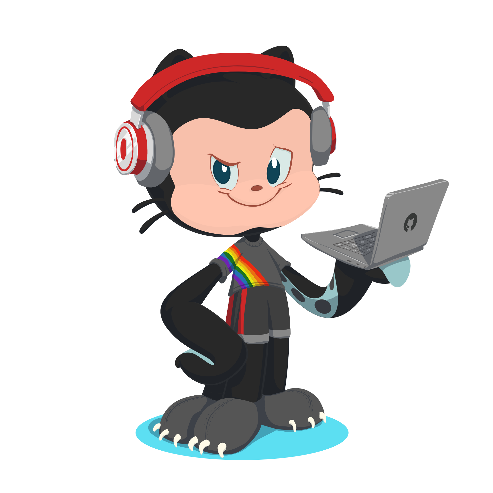

  

   <h3> 👨‍💻 technologies </h3>

   
  
  <h3> 💻 Workspace </h3>
 
 
 

<table>
  <tr>
    <td align="center">
      
    </td>
    <td align="center">
      
    </td>
  </tr>
</table>

   <h3>📲 contact </h3>
   

  
<a href="mailto:savio.dantas.5858@gmail.com?subject=Olá Sávio"> 
  

